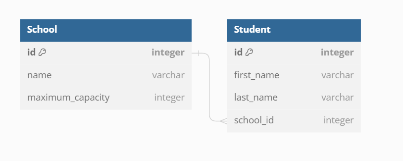

> Create an API for schools and students, meeting the details shown below.

For this API are shown the following requirements. Included in *requirements.txt*. It is assumed the user walked through the basic tutorial of Django Rest Framework.

    Python 3.11.5
    Django 4.2.6 
    djangorestframework 3.14.0 
    

## Preparing the project

     django-admin startproject project_name 
     django-admin startapp app_name
     # Sync DB
     python manage.py migrate
     # Run server
     python manage.py runserver

## Modified files from the boilerplate
Create models inside the app, School and Student with foreign key as a school `app_name/models.py`

Create serializers, with fields of interest printed on the JSON examples `app_name/serializers.py`

Create views, using viewsets `app_name/views.py`  for students check if the school is full of not, rewriting a new create method. 

Looking up for students or schools. To accomplish this: rewrite `get_queryset` method to retrieve schools or students containing the string of the search param in their name.

### Database Models
Database model description and graph, generated with dbdiagram.io

    Table School {
        id integer [primary key]
        name varchar
        maximum_capacity integer
    }

    Table Student {
        id integer [primary key]
        first_name varchar
        last_name varchar
        school_id integer
    }

    Ref: School.id < Student.school_id 

### Sample objects
School Object

    {
        "name": "IES Navarro Villoslada",
        "maximum_capacity": 3,
        "students": [
            {
                "first_name": "Alberto1",
                "last_name": "Fernandez1",
                "school_id": 1
            },
            {
                "first_name": "Alberto2",
                "last_name": "Fernandez2",
                "school_id": 1
            },
            {
                "first_name": "Alberto3",
                "last_name": "Fernandez3",
                "school_id": 1
            }
        ]
    }

Student Object, with School as a foreign key

    { "first_name": "Alberto1", "last_name": "Fernandez1", "school_id": 1 },

### Table summary School endpoint
API endpoint is after `server_address:port/api/`

|School Endpoint         | HTTP Method  | CRUD Method | Result                                                   |
|:----------------------:|:------------:|-------------|----------------------------------------------------------|
| school/                | GET          | READ        | List all schools with its nested students                |
| school/`int:pk`        | GET          | READ        | List a school given its id, shows nested nested students |
| school/?search=`param` | GET          | READ        | Returns the schools cointaining the string _param_       |
| school/                | POST         | CREATE      | Creates a school                                         |
| school/`int:pk`        | DELETE       | DELETE      | deletes a single school                                  |

### Table summary Student endpoint
API endpoint is after `server_address:port/api/`

| Student Endpoint        | HTTP Method | CRUD Method | Result                                                    |
|-------------------------|-------------|-------------|-----------------------------------------------------------|
| student/                | GET         | READ        | List all students with its nested students                |
| student/`int:pk`        | GET         | READ        | List a student given its id, shows nested nested students |
| student/?search=`param` | GET         | READ        | Returns the students cointains the string _param_         |
| student/                | POST        | CREATE      | Create a student if `maximum_capacity` of the school is not reached|
| student/`int:pk`        | DELETE      | DELETE      | deletes a single student                                  |

# Tests

To run tests it is necessary to run `manage.py test`, which will execute the different kind of tests, inside the folder `project_name/app_name/tests`
